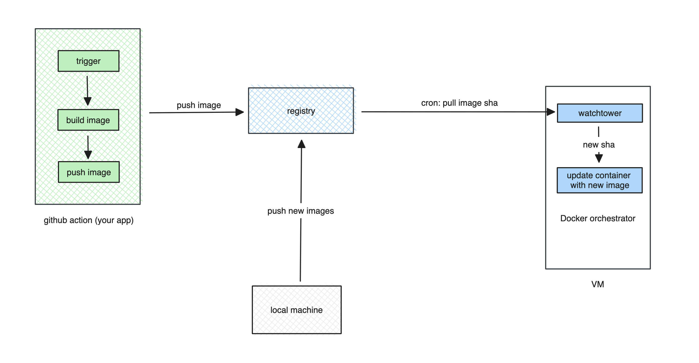

## Meet-lab

Collection of Docker files for systems in the lab room.
### Base components / admin components
1. Composes
- [granfa](https://github.com/grafana/grafana)
- [loki](https://github.com/grafana/loki): using for log
- [prometheus](https://github.com/prometheus/prometheus): monitoring system
- [cadvisor](https://github.com/google/cadvisor): Analyzes resource usage and performance characteristics of running containers
    
- [nginx-proxy](https://github.com/nginx-proxy/nginx-proxy): Automated nginx proxy for Docker containers using docker-gen
- [ufw-docker-automated](https://github.com/shinebayar-g/ufw-docker-automated): About
Manage docker containers firewall with UFW!

- [containrrr/watchtower](https://github.com/containrrr/watchtower): A process for automating Docker container base image updates.
1. Files
- [admin](./docker/docker-compose-admin.yml)
- [nginx-proxy](./docker/docker-compose-proxy.yml)
- [tools](./docker/docker-compose-tools.yml)
### Applications

> Add your app service in the docker-compose file or in another file (dosn't add to admin and tool files)

## How auto release your app with Watchtower ? 

> Checkout this diagram (maintainer @9bany)

## How to release

> This convention is used for this repository, not your application.
### Simple Release

All services were configured in docker-compose. This will trigger a release to the VM when the master branch has a new commit. This means that all requests that have been merged to the master will create a release to the VM.

### Specifying a Release

You need to create a new tag and push it. Github action is listening for that event and will eventually create a new release.
#### Rules

| components  | tag rule | example  |
|---|---|---|
|  admin | `db-realease*`  |  `db-realease-v0.0.1rc01`, `db-realease-v0.0.1,...etc` |
|  antelope | `atl-realease*`  | `atl-realease-v0.0.1rc01`, `atl-realease-v0.0.1`, ...etc  |
